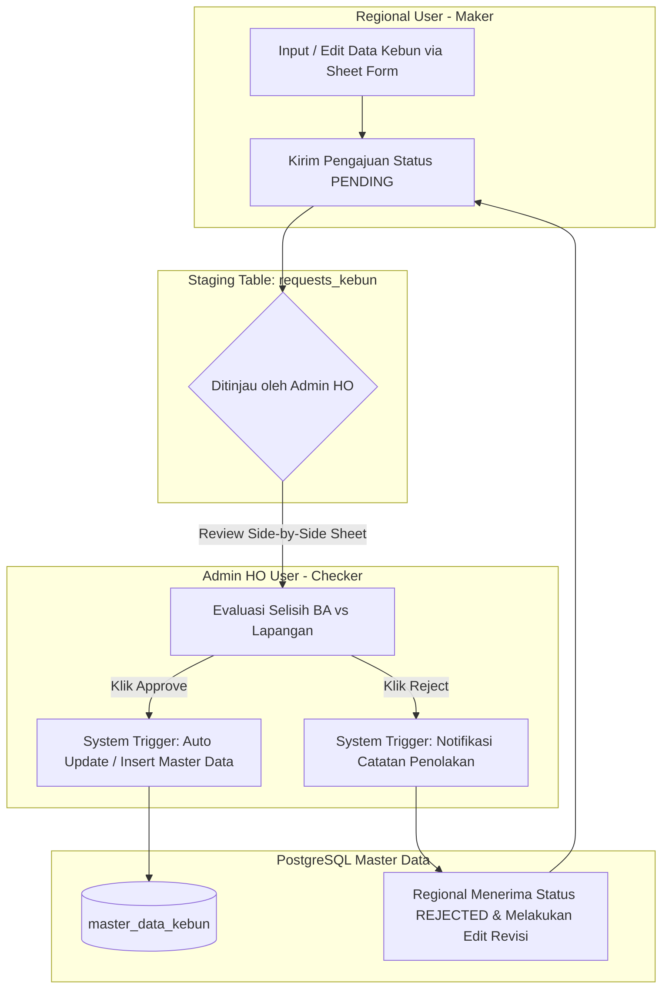

# 📋 AgriDaM (Agrinas Data Master) V2 - Product Requirement Document (PRD)

---

## 1. Document Overview

### 1.1 Product Vision
**AgriDaM (Agrinas Data Master) V2** adalah Web Application Enterprise berbasis **Next.js (App Router)** & **Supabase (PostgreSQL)** yang berfungsi sebagai pusat sistem **Master Data Management (MDM)** penguasaan dan verifikasi lahan perkebunan kelapa sawit milik **PT Agrinas Palma Nusantara**. 

Sistem ini merekonsiliasi data luasan lahan dari tiga sudut pandang utama:
1. **Head Office (HO) GIS & Satgas PKH**: Baseline luasan Berita Acara (BA) & pemetaan drone.
2. **Verifikasi Lapangan Regional**: Hasil pengecekan aktual oleh tim Regional di 22+ wilayah kerja dan 10 kelompok CRO.
3. **Status Penguasaan & Planted Dikelola/Dipanen**: Penjabaran lahan Dikuasai vs Tidak Dikuasai serta jumlah pokok pohon sawit aktual.

### 1.2 Key Architectural Evolution (Spreadsheet to Web Enterprise)
- **Maker-Checker Governance**: Menggantikan spreadsheet manual dengan alur pengajuan *staging* (`requests_kebun`). Akun Regional bertindak sebagai **Maker** (pengaju), dan Admin Head Office bertindak sebagai **Checker/Approver** (penyetuju).
- **Relational PostgreSQL Database**: Menggunakan Supabase dengan skema 39+ kolom data kebun, pemicu otomatis (*PostgreSQL Triggers*), dan *Row Level Security* (RLS).
- **Modern Clean UI/UX**: Antarmuka responsif menggunakan **Shadcn UI (Sheet components)**, animasi slide-in, serta tema kontras terang dengan teks hitam pekat untuk efisiensi input data yang panjang.
- **Production Cloud Infrastructure**: Siap di-deploy ke **Vercel** dan **Google Cloud Run (GCP)** menggunakan kontainerisasi Docker multi-stage standalone.

---

## 2. Struktur Pengguna & Hak Akses (Role-Based Access Control)

| Peran System | Otoritas & Responsibilitas | Alur & Antarmuka UI |
|---|---|---|
| **Maker (Regional Account)** | Melakukan verifikasi lapangan, mencatat luasan lahan, jumlah pokok, status KSO, dan mengoperkan draf ke HO. | Form pengisian berbasis **`Sheet`** (5 Blok Isian). Hanya dapat melihat data wilayahnya. Status pengajuan: `PENDING`, `APPROVED`, `REJECTED` (dapat direvisi jika ditolak). |
| **Checker (Admin Head Office)** | Meninjau pengajuan dari Regional, merekonsiliasi selisih luasan BA vs lapangan, dan memberi keputusan persetujuan. | Tabel Antrean Persetujuan & Modal **`Sheet Review Side-by-Side`**. Memiliki tombol aksi langsung (*Approve*, *Reject* dengan alasan, *Direct Edit/Delete Bypass*). |
| **Executive Management** | Memantau KPI nasional, total penguasaan areal, selisih verifikasi BA Satgas, serta distribusi status KSO/Kelola Mandiri. | Dashboard Analytics, Rekapitulasi Otomatis per CRO/Wilayah, Export Excel/CSV. |

---

## 3. Alur Kerja Sistem (Workflow & Maker-Checker System)



---

## 4. Struktur Form & Skema Data Form Regional (5 Blok Utama)

Pada akun Regional, modal pengisian data ditampilkan dalam bentuk **Sheet** (panel samping meluncur) dengan 5 kelompok section utama:

### 4.1 Section 1: Penguasaan Areal Planted (Ha)
- `Nama Kebun/PT Aktual di Lapangan` (Teks)
- `Nama Mitra/Vendor` (Teks - untuk skema KSO)
- `Keterangan` (Catatan status/proses)
- **Sub-Blok Rincian Dikuasai vs Tidak Dikuasai (Ha)**:
  - *Inti*: Dikuasai (Ha) & Tidak Dikuasai (Ha)
  - *Plasma*: Dikuasai (Ha) & Tidak Dikuasai (Ha)
  - *Masyarakat*: Dikuasai (Ha) & Tidak Dikuasai (Ha)
  - *TBM*: Dikuasai (Ha) & Tidak Dikuasai (Ha)
  - *Total Penguasaan*: Kalkulasi otomatis penjumlahan seluruh sub-blok.

### 4.2 Section 2: Wilayah Administrasi
- `Provinsi` (Teks / Dropdown)
- `Kabupaten` (Teks / Dropdown)

### 4.3 Section 3: Status & Penjelasan
- `Status` (Dropdown: `Belum Dikelola` | `KSO` | `Kelola Mandiri` | `Dikelola Sendiri`)
- `Penjelasan` (Teks naratif detail kondisi hukum/lahan)

### 4.4 Section 4: Planted Dikelola atau Dipanen (Rincian Luas & Pokok)
Menjabarkan luas area produktif dan populasi pohon sawit aktual:
- *Inti*: Luas (Ha) & Jumlah Pokok
- *Plasma*: Luas (Ha) & Jumlah Pokok
- *Masyarakat*: Luas (Ha) & Jumlah Pokok
- *TBM*: Luas (Ha) & Jumlah Pokok

### 4.5 Section 5: Verifikasi Regional (Ha)
- `Planted Sawit Inti` (Ha)
- `Planted Sawit Plasma` (Ha)
- `Planted Sawit Masyarakat` (Ha)
- `Total Planted Sawit`: Formula otomatis (`Inti + Plasma + Masyarakat`)
- `TBM` (Ha)
- `Areal Lain-lain` (Ha)
- `Total Area`: Formula otomatis (`Total Planted Sawit + TBM + Areal Lain-lain`)

---

## 5. Arsitektur Database Supabase (PostgreSQL Schema)

Sistem menggunakan tabel utama `master_data_kebun`, tabel *staging* `requests_kebun`, tabel profil `profiles`, serta fungsi otomatisasi pemicu persetujuan (*Trigger Function*):

```sql
-- TABEL MASTER DATA KEBUN (RINGKASAN SKEMA UTAMA)
CREATE TABLE public.master_data_kebun (
    id UUID PRIMARY KEY DEFAULT uuid_generate_v4(),
    cro TEXT NOT NULL DEFAULT 'CRO 1',
    wilayah TEXT NOT NULL,
    nama_kebun_pt TEXT NOT NULL,
    nama_kebun_aktual TEXT NOT NULL,
    nama_mitra_vendor TEXT DEFAULT '-',
    kode_tag_kebun TEXT NOT NULL,
    keterangan TEXT DEFAULT '-',
    tahapan TEXT NOT NULL DEFAULT 'Tahap 1',
    status TEXT NOT NULL DEFAULT 'Belum Dikelola',
    penjelasan TEXT DEFAULT '-',

    -- Data HO
    luas_ba NUMERIC(12, 2) NOT NULL DEFAULT 0.00,
    luas_shp_awal NUMERIC(12, 2) NOT NULL DEFAULT 0.00,
    ho_planted_inti NUMERIC(12, 2) NOT NULL DEFAULT 0.00,
    ho_planted_plasma NUMERIC(12, 2) NOT NULL DEFAULT 0.00,
    ho_planted_masyarakat NUMERIC(12, 2) NOT NULL DEFAULT 0.00,
    ho_total_planted NUMERIC(12, 2) GENERATED ALWAYS AS (ho_planted_inti + ho_planted_plasma + ho_planted_masyarakat) STORED,
    ho_tbm NUMERIC(12, 2) NOT NULL DEFAULT 0.00,
    ho_areal_lain NUMERIC(12, 2) NOT NULL DEFAULT 0.00,
    ho_total_verifikasi NUMERIC(12, 2) GENERATED ALWAYS AS (ho_planted_inti + ho_planted_plasma + ho_planted_masyarakat + ho_tbm + ho_areal_lain) STORED,
    selisih_verifikasi NUMERIC(12, 2) GENERATED ALWAYS AS (luas_ba - (ho_planted_inti + ho_planted_plasma + ho_planted_masyarakat + ho_tbm + ho_areal_lain)) STORED,

    -- Verifikasi Regional
    reg_planted_inti NUMERIC(12, 2) NOT NULL DEFAULT 0.00,
    reg_planted_plasma NUMERIC(12, 2) NOT NULL DEFAULT 0.00,
    reg_planted_masyarakat NUMERIC(12, 2) NOT NULL DEFAULT 0.00,
    reg_total_planted NUMERIC(12, 2) GENERATED ALWAYS AS (reg_planted_inti + reg_planted_plasma + reg_planted_masyarakat) STORED,
    reg_tbm NUMERIC(12, 2) NOT NULL DEFAULT 0.00,
    reg_areal_lain NUMERIC(12, 2) NOT NULL DEFAULT 0.00,
    reg_total_area NUMERIC(12, 2) GENERATED ALWAYS AS (reg_planted_inti + reg_planted_plasma + reg_planted_masyarakat + reg_tbm + reg_areal_lain) STORED,

    -- Status Penguasaan
    inti_dikuasai NUMERIC(12, 2) NOT NULL DEFAULT 0.00,
    inti_tidak_dikuasai NUMERIC(12, 2) NOT NULL DEFAULT 0.00,
    plasma_dikuasai NUMERIC(12, 2) NOT NULL DEFAULT 0.00,
    plasma_tidak_dikuasai NUMERIC(12, 2) NOT NULL DEFAULT 0.00,
    masyarakat_dikuasai NUMERIC(12, 2) NOT NULL DEFAULT 0.00,
    masyarakat_tidak_dikuasai NUMERIC(12, 2) NOT NULL DEFAULT 0.00,
    tbm_dikuasai NUMERIC(12, 2) NOT NULL DEFAULT 0.00,
    tbm_tidak_dikuasai NUMERIC(12, 2) NOT NULL DEFAULT 0.00,
    total_penguasaan NUMERIC(12, 2) GENERATED ALWAYS AS (inti_dikuasai + inti_tidak_dikuasai + plasma_dikuasai + plasma_tidak_dikuasai + masyarakat_dikuasai + masyarakat_tidak_dikuasai + tbm_dikuasai + tbm_tidak_dikuasai) STORED,

    -- Administratif & Planted Dikelola/Dipanen
    provinsi TEXT NOT NULL DEFAULT '-',
    kabupaten TEXT NOT NULL DEFAULT '-',
    dikelola_inti_luas NUMERIC(12, 2) DEFAULT 0.00,
    dikelola_inti_pokok INT DEFAULT 0,
    dikelola_plasma_luas NUMERIC(12, 2) DEFAULT 0.00,
    dikelola_plasma_pokok INT DEFAULT 0,
    dikelola_masyarakat_luas NUMERIC(12, 2) DEFAULT 0.00,
    dikelola_masyarakat_pokok INT DEFAULT 0,
    dikelola_tbm_luas NUMERIC(12, 2) DEFAULT 0.00,
    dikelola_tbm_pokok INT DEFAULT 0,

    created_at TIMESTAMPTZ NOT NULL DEFAULT NOW(),
    updated_at TIMESTAMPTZ NOT NULL DEFAULT NOW()
);
```

---

## 6. Spesifikasi Infrastruktur & Deployment Cloud

- **Frontend Framework**: Next.js 14 (App Router) + TypeScript + Tailwind CSS
- **Design & UI**: Custom Clean Light Theme (Shadcn Sheet UI, Field Layout, Alert Banners, Lucide Icons)
- **Backend & Database**: Supabase (PostgreSQL 15 + Auth + Realtime + RLS)
- **Containerization**: Multi-stage Dockerfile (`output: 'standalone'`)
- **Hosting Target**: 
  1. **Vercel** (Global Edge CDN Deployment) — Active Live Target
  2. **Google Cloud Run (GCP)** (Serverless Container in `asia-southeast1` Jakarta)

---

## 7. Success Metrics & KPI System V2

- **Zero-Loss Data Reconciliation**: Selisih verifikasi BA Satgas vs Lapangan terdeteksi secara otomatis dan transparan.
- **Fast Maker-Checker Cycle**: Waktu siklus pengajuan Regional hingga persetujuan HO rata-rata < 24 jam.
- **100% Auditability**: Seluruh transaksi pengajuan dan revisi tercatat dalam log notifikasi & staging table.
- **Enterprise-Grade Availability**: Uptime 99.9% menggunakan infrastruktur cloud serverless (Vercel / Cloud Run) yang otomatis menyesuaikan kapasitas (*auto-scaling*).

---
*Dokumen PRD V2 ini merupakan spesifikasi resmi sistem AgriDaM yang sudah diimplementasikan dan berjalan live di [https://agridam-v-2.vercel.app](https://agridam-v-2.vercel.app).*
