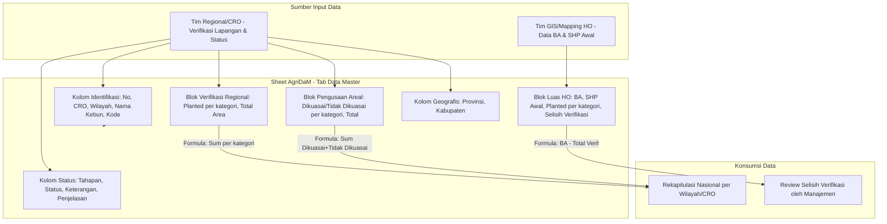

# 📋 AgriDaM (Agrinas Data Master) - Product Requirement Document (PRD)

---

## 1. Document Overview

### 1.1 Product Vision
**AgriDaM (Agrinas Data Master)** adalah *master spreadsheet* berbasis Google Sheets yang berfungsi sebagai pusat data penguasaan dan verifikasi lahan kebun kelapa sawit milik **PT Agrinas Palma Nusantara**. Spreadsheet ini merekonsiliasi tiga sumber data luasan lahan — data pemetaan partisipatif & drone dari Head Office (HO), hasil verifikasi lapangan oleh tim Regional, dan status penguasaan areal aktual — ke dalam satu baris data per unit kebun/PT, sehingga manajemen dapat memantau status legal, operasional, dan luasan setiap unit kebun di seluruh wilayah kerja perusahaan.

### 1.2 Problem Statement
- **Sumber Data Ganda & Tidak Sinkron**: Data luas lahan hasil Berita Acara (BA) Satgas PKH/Head Office seringkali berbeda dengan hasil verifikasi lapangan oleh tim Regional, tanpa mekanisme pembanding yang jelas.
- **Status Penguasaan Tidak Terstandarisasi**: Ratusan unit kebun/PT tersebar di banyak wilayah (Aceh, Sumut, Riau, dst.) memiliki status hukum dan operasional yang berbeda-beda (Belum Dikelola, KSO, Kelola Mandiri, Dikelola Sendiri) dan mudah tidak konsisten jika dicatat manual per wilayah.
- **Sulit Melacak Selisih Data**: Tanpa kolom pembanding otomatis, selisih antara luas BA dan luas hasil verifikasi regional sulit dideteksi secara cepat sehingga anomali data (misalnya lahan yang "hilang" atau bertambah) terlambat diketahui.
- **Kebutuhan Rekapitulasi Multi-Kategori**: Luas lahan perlu dipilah berdasarkan kategori kepemilikan/skema (Inti, Plasma, Masyarakat, TBM, Areal Lain-lain) dan status kontrol (Dikuasai vs Tidak Dikuasai), yang sulit direkap manual secara konsisten lintas 22+ wilayah regional dan 3 kelompok CRO.

### 1.3 Target Audience
1. **Tim Regional / CRO (Chief Regional Officer)**: Bertanggung jawab menginput dan memperbarui data kebun/PT di wilayahnya, termasuk hasil verifikasi lapangan dan status penguasaan areal.
2. **Tim Verifikasi Areal / GIS-Mapping (Head Office)**: Menyediakan data awal luas lahan hasil Participatory Mapping & Drone (BA, SHP Awal) sebagai baseline pembanding.
3. **Manajemen / Head Office Agrinas Palma Nusantara**: Menggunakan AgriDaM sebagai dashboard rekapitulasi nasional untuk memantau progres penguasaan lahan, status KSO/Kelola Mandiri, dan selisih verifikasi di seluruh unit kebun.

---

## 2. Struktur Pengguna & Tanggung Jawab Data

| Peran | Tanggung Jawab Utama | Kolom yang Diinput/Dikelola |
|---|---|---|
| **Tim GIS / Mapping HO** | Menyediakan baseline luas lahan dari pemetaan partisipatif dan drone | Kolom `BA`, `SHP Awal`, dan rincian *Planted Sawit* versi Head Office (kolom N–U) |
| **Tim Regional / CRO** | Melakukan verifikasi lapangan, mencatat status penguasaan, dan mitra kerja sama | `Nama Kebun/PT Aktual di Lapangan`, `Nama Mitra/Vendor`, `Kode/Tag Kebun`, `Keterangan`, `Tahapan`, `Status`, `Penjelasan`, kolom Verifikasi Regional (W–AC), dan Pengusaan Areal Planted (AD–AL) |
| **Manajemen/HO Pusat** | Mereview selisih verifikasi dan mengambil keputusan tindak lanjut (mis. klarifikasi BA, negosiasi KSO) | Membaca kolom `Selisih Verifikasi (BA - Verif)` dan status agregat per wilayah/CRO |

---

## 3. Cara Kerja & Alur Data

### 3.1 Identifikasi & Pengelompokan Unit Kebun
Setiap baris data mewakili **satu unit kebun/PT/mitra** dengan pengelompokan berjenjang:
- **CRO** (`CRO 1`, `CRO 2`, `CRO 3`, dst.) — pengelompokan area kerja tingkat atas (mis. CRO 1 menaungi Regional Aceh & Sumut).
- **Wilayah** (mis. `Regional Aceh`, `Regional Sumut 1`, `Regional Riau 1`) — unit kerja regional di bawah CRO.
- **Nama Kebun/PT** vs **Nama Kebun/PT Aktual di Lapangan** — nama legal/administratif dibandingkan dengan nama operasional yang dipakai di lapangan (untuk mengakomodasi kasus rebranding, pemecahan kebun, atau perbedaan penamaan historis).
- **Kode/Tag Kebun** — kode unik unit kebun (format `[Tipe]-[Singkatan]-[Nomor urut]`, mis. `PT-BPA-01`, `KB-DPN-02`) untuk referensi silang antar sheet/laporan.
- **Nama Mitra/Vendor** — diisi bila kebun dikelola melalui kerja sama operasi (KSO) dengan pihak ketiga.

### 3.2 Klasifikasi Tahapan & Status Penguasaan
Setiap unit kebun memiliki dua atribut status:
- **Tahapan** (`Tahap 1` s.d. `Tahap 5`) — merepresentasikan progres administratif/legal penguasaan lahan (semakin tinggi tahap, umumnya semakin kompleks proses klarifikasi arealnya).
- **Status** — kondisi operasional saat ini, dengan nilai baku:
  - `Belum Dikelola` — lahan belum dikuasai/dikelola oleh Agrinas.
  - `KSO` / `Kerja Sama Operasi (KSO)` — dikelola melalui kerja sama dengan mitra/vendor.
  - `Kelola Mandiri` — dikelola langsung tanpa mitra eksternal.
  - `Dikelola Sendiri` — dikelola langsung oleh entitas Agrinas.
- Kolom **Keterangan** dan **Penjelasan** menampung catatan naratif (mis. status SPK, sengketa, klaim tumpang tindih, progres negosiasi) sebagai konteks kualitatif atas status di atas.

### 3.3 Rekonsiliasi Tiga Sumber Data Luasan
Inti dari AgriDaM adalah membandingkan tiga blok data luasan lahan (dalam hektar) secara berdampingan per baris:

1. **Luas Participatory Mapping & Drone (Data HO)** — baseline dari Head Office:
   - `BA` (luas hasil Berita Acara Satgas PKH), `SHP Awal`, lalu rincian planted per kategori (`Inti`, `Plasma`, `Masyarakat`), `Total Planted Sawit`, `TBM`, `Areal Lain-lain`, dan `Total Areal Verifikasi`.
   - Kolom **`Selisih Verifikasi (BA - Verif)`** dihitung otomatis sebagai `BA − Total Areal Verifikasi`, menjadi indikator utama untuk mendeteksi ketidakcocokan data HO vs lapangan.

2. **Verifikasi Regional** — hasil pengecekan lapangan oleh tim Regional, dengan struktur kategori yang sama (`Inti`, `Plasma`, `Masyarakat`, `Total Planted Sawit`, `TBM`, `Areal Lain-lain`, `Total Area`). Kolom `Total Planted Sawit` dan `Total Area` di blok ini merupakan penjumlahan otomatis dari sub-kategori di kiri-kanannya.

3. **Pengusaan Areal Planted** — status kontrol aktual atas lahan, memecah setiap kategori (`Inti`, `Plasma`, `Masyarakat`, `TBM`) menjadi dua sub-status: **Dikuasai** vs **Tidak Dikuasai**, lalu dijumlahkan menjadi `Total` (penjumlahan seluruh sel Dikuasai/Tidak Dikuasai per kategori).

Struktur berjenjang ini memungkinkan pembanding cepat: *berapa luas yang diklaim HO → berapa yang terverifikasi di lapangan → berapa dari yang terverifikasi itu yang benar-benar dikuasai secara operasional.*

### 3.4 Data Administratif Lokasi
Kolom **Provinsi** dan **Kabupaten** melengkapi setiap baris untuk mendukung rekapitulasi dan pelaporan berbasis wilayah administratif (di luar struktur internal CRO/Wilayah perusahaan), memudahkan cross-check dengan data pemerintah/Satgas.

### 3.5 Perhitungan & Validasi Otomatis (Formula)
Beberapa kolom bersifat turunan (dihitung, bukan input manual):
- `Total Planted Sawit` (Verifikasi Regional) = `Inti + Plasma + Masyarakat`
- `Total Area` (Verifikasi Regional) = `Total Planted Sawit + TBM + Areal Lain-lain`
- `Total` (Pengusaan Areal Planted) = jumlah seluruh sel Dikuasai + Tidak Dikuasai dari 4 kategori (Inti, Plasma, Masyarakat, TBM)
- `Selisih Verifikasi (BA - Verif)` = `BA − Total Areal Verifikasi (HO)`

Baris nomor urut kolom (baris ke-5 pada sheet) menyimpan referensi eksplisit rumus ini (mis. `25 = 22+23+24`, `37 = 29+30+31+32+33+34+35+36`) sebagai dokumentasi internal formula bagi pengguna sheet.

---

## 4. Arsitektur Spreadsheet

### 4.1 Teknologi
- **Platform**: Google Sheets (Google Workspace), dapat diakses via web browser dan aplikasi mobile Google Sheets.
- **Kolaborasi**: Multi-user real-time editing dengan riwayat perubahan (Version History) bawaan Google Sheets.
- **Formula Engine**: Google Sheets native formulas (SUM, penjumlahan antar kolom) untuk kolom-kolom turunan (Total, Selisih).
- **Format Visual**: Kemungkinan menggunakan *conditional formatting* bawaan Google Sheets untuk menyorot baris dengan selisih verifikasi signifikan (berdasarkan indikasi menu "Conditional formatting" yang terlihat aktif pada sheet).

---

## 5. Spesifikasi Struktur Kolom (Skema Data)

| No Kolom | Nama Kolom | Tipe/Format | Keterangan |
|---|---|---|---|
| 1 | No | Angka urut | Nomor baris data unit kebun |
| 2 | CRO | Teks | Pengelompokan area kerja tingkat atas (mis. CRO 1, CRO 2, CRO 3) |
| 3 | Wilayah | Teks | Regional di bawah CRO (mis. Regional Aceh, Regional Riau 1) |
| 4 | Nama Kebun/PT | Teks | Nama legal/administratif entitas |
| 5 | Nama Kebun/PT Aktual di Lapangan | Teks | Nama operasional yang dipakai di lapangan |
| 6 | Nama Mitra/Vendor | Teks | Nama mitra KSO (jika ada) |
| 7 | Kode/Tag Kebun | Teks | Kode unik unit kebun |
| 8 | Keterangan | Teks bebas | Catatan status/proses (mis. sedang proses SPK) |
| 9 | Tahapan | Teks (Tahap 1–5) | Tahapan progres administratif |
| 10 | Status | Teks kategorikal | Belum Dikelola / KSO / Kelola Mandiri / Dikelola Sendiri |
| 11 | Penjelasan | Teks bebas panjang | Narasi detail kondisi lahan/proses |
| 12 | BA | Numerik (Ha) | Luas Berita Acara Satgas PKH / HO |
| 13 | SHP Awal | Numerik (Ha) | Luas shapefile awal |
| 14–19 | Planted Sawit Inti/Plasma/Masyarakat/Total/TBM/Areal Lain-lain (HO) | Numerik (Ha) | Rincian luas versi Head Office |
| 20 | Total Areal Verifikasi | Numerik (Ha), formula | Total dari kolom 17+18+19 |
| 21 | Selisih Verifikasi (BA - Verif) | Numerik (Ha), formula | `BA − Total Areal Verifikasi` |
| 22–24 | Planted Sawit Inti/Plasma/Masyarakat (Regional) | Numerik (Ha) | Hasil verifikasi lapangan tim Regional |
| 25 | Total Planted Sawit (Regional) | Numerik (Ha), formula | `22+23+24` |
| 26–27 | TBM, Areal Lain-lain (Regional) | Numerik (Ha) | |
| 28 | Total Area (Regional) | Numerik (Ha), formula | `25+26+27` |
| 29–36 | Inti/Plasma/Masyarakat/TBM × Dikuasai/Tidak Dikuasai | Numerik (Ha) | Status kontrol aktual per kategori |
| 37 | Total (Pengusaan Areal Planted) | Numerik (Ha), formula | Jumlah kolom 29–36 |
| 38 | Provinsi | Teks | Provinsi lokasi kebun |
| 39 | Kabupaten | Teks | Kabupaten/kota lokasi kebun |

---

## 6. Kebutuhan Non-Fungsional

1. **Integritas Data**:
   - Kolom hasil formula (Total, Selisih) tidak boleh ditimpa input manual agar rekonsiliasi tetap akurat.
   - Perubahan nilai `BA`/`SHP Awal` (data HO) sebaiknya dibatasi hanya untuk tim GIS/Mapping guna menjaga baseline tetap konsisten.
2. **Kolaborasi & Akses**:
   - Level akses berbeda idealnya diterapkan antara tim Regional (edit wilayah masing-masing) dan Head Office (visibilitas nasional penuh), memanfaatkan fitur *protected ranges* Google Sheets.
3. **Auditability**:
   - Riwayat perubahan (Version History) dan kolom `Keterangan`/`Penjelasan` menjadi jejak audit atas perubahan status maupun luasan.
4. **Skalabilitas**:
   - Struktur baris-per-unit-kebun harus tetap dapat menampung penambahan unit kebun/PT baru maupun pemecahan unit kebun (mis. `Bukit Harapan I` dan `II` dari `PT Torganda`) tanpa mengubah struktur kolom.

---

## 7. Success Metrics (KPI)

- **Selisih Verifikasi Mendekati Nol**: Berkurangnya jumlah baris dengan `Selisih Verifikasi (BA - Verif)` signifikan, menandakan data HO dan Regional makin sinkron.
- **Kelengkapan Status**: 100% unit kebun memiliki nilai `Tahapan` dan `Status` terisi (tidak ada baris kosong/`Belum Dikelola` tanpa keterangan lanjutan).
- **Akurasi Kategori Penguasaan**: Total luas `Dikuasai` per kategori (Inti/Plasma/Masyarakat/TBM) dapat direkonsiliasi dengan total luas Verifikasi Regional tanpa selisih signifikan.
- **Kecepatan Update Regional**: Data verifikasi lapangan dan status KSO/Kelola Mandiri diperbarui tim Regional secara berkala (mis. bulanan) mengikuti progres aktual di lapangan.

---

*Catatan: PRD ini disusun berdasarkan struktur kolom dan data yang terlihat pada tab "AgriDaM (Agrinas Data Master)" (gid=803428685). Karena sheet diakses tanpa kredensial login, kemungkinan terdapat tab/sheet lain, formula tersembunyi, atau conditional formatting rules dalam file yang sama yang tidak tercakup dalam dokumen ini.*
